# Task manager
Task Manager is a frontend application that allows users to create, edit, remove tasks and share their opinions in the form of comments. 

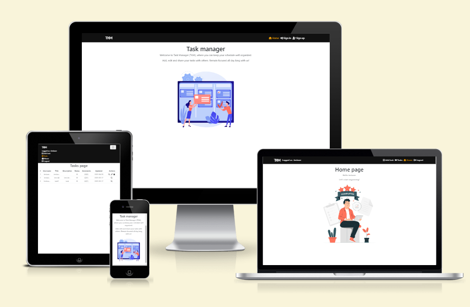
## Strategy plane 
### Site goals 

The aim of this Task Manager application is to provide a platform to organize various activities efficiently while allowing its users to express their opinions with each other or, if they wish to, add notes to themselves.
## Table of Contents 
 
* [Stategy plane](#strategy-plane)
    * [Site goals](#site-goals)
* [Agile plannning](#agile-planning)
* [Epics](#epics)
* [User stories](#user-stories)
* [Structure plane](#structure-plane)
    * [Features](#features)
    * [Planned features](#planned-features)
* [Skeleton plane](#skeleton-plane)
    * [Wireframes](#wireframes)
* [Surface plane](#surface-plane)
    * [Colour scheme](#colour-scheme)
* [Technologies](#technologies)
* [Testing](#testing)
* [Deployment](#deployment)
    * [Version control](#version-control)
    * [Heroku deployment](#heroku-deployment)
    * [Clone the repository locally](#clone-the-repository-locally)
* [Credits](#credits)
    * [Honourable mentions](#honourable-mentions)


## Agile planning 
The project was developed by using agile methodologies. The development cycle was divided into five sprints, where code was delivered in small chunks for flexibility and good coding practice.

The Kanban board was created to keep track of project progression and task assessment. Tasks were given acceptance criteria. In addition, they were marked with labels and assigned to project epics.
### Epics 

1. Setup
The base setup epic is for all stories needed for the base setup of the application. Without initial steps, the development of the application would not be possible under the given conditions and constraints.

2. Prototype
The prototype epic is for all stories needed to create an application prototype. Creating a prototype with a working backend, was essential in building new features.

3. Profiles
The profiles epic is for all stories related to the creation of user profiles (accounts) and user authentication.

4. Tasks
The tasks epic is for all stories related to tasks. Tasks are core content that the user can view and interact with.

5. Comments
The epic cover the user stories related to creating, editing, updating or removing comments

6. Standalone issues
This epic is for all stories related to functionalities that don't have their epic. Dependant or tiny features that are not critical but influence the overall experience belongs to this epic.

7. Deployment 
This epic is for deployment-related stories. Hosting a site on Heroku allows connecting the frontend application to the backend.

8. Documentation
This epic is for document-related stories. It provides essential documentation to give an insight into the development process and explain all stages of the software production cycle.

[Back to Table of contents](#table-of-contents)
## User stories 

1. Setup
* As a developer, I need to create a navbar, so user can navigate between pages
* As a developer, I need to implement correct axios settings so that a user that is logged in, can post requests to the backend, even after access token expiration
* As a developer, I need to add linting tools so my code adheres to coding standards
2. Prototype
* As a developer, I would like to have a local database setup, so I can interact with it, and test a frontend application
3. Profiles
* As a user, I want to be able to create a profile (account) so that I can application content in full
* As a user, I want to be able to sign in to the application so that I can interact with the application's content
4. Tasks
* As a user, I want to be able to view, edit or delete a task, so I can organize various actions if I change my mind
* As a user I want to create a task so I can keep myself organized
5. Comments
* As a user, I want to comment on each task, to interact with other users
* As a user, I would like to view, edit or delete a comment, if I change my mind about it
6. Standalone issues
* As a developer, I need to redirect users to my application when they try to access a page that does not exist
* As a developer, I need to design a home page, so it can convey basic information about an application to users
7. Deployment
* As a developer, I have to deploy the project so the users can visit the frontend application and interact with the content.
8. Documentation
* As a developer, I need to write README.md so others can check the documentation and gain a better understanding of application principles
* As a developer, I need to write TESTING.md to test the application thoroughly and to allow other testers to follow the same steps in the testing process

[Back to Table of contents](#table-of-contents)

## Structure plane 

### Features 

User story : 

`As a developer, I need to design a home page, so it can convey basic information about an application to users`

Implementation : 

The home page, with content dependent on user authentication status, was created with the following features:

Favicon: 

Favicon was implemented to ensure easier navigation between different tabs on the browser


Hero image was implemented alongside short messages to present a website's goals in a quick and efficient manner

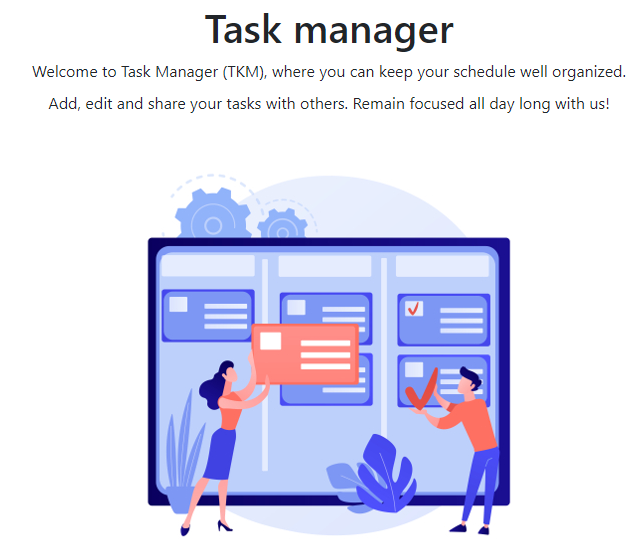

User story:
`As a developer, I need to create a navbar, so user can navigate between pages`

Implementation:

A navigation bar was implemented that collapses on smaller screen sizes


User story:
`As a user, I want to be able to create a profile (account) so that I can access application content in full`

Implementation: 

Sign up form was created to provide an interface where a user can create an account

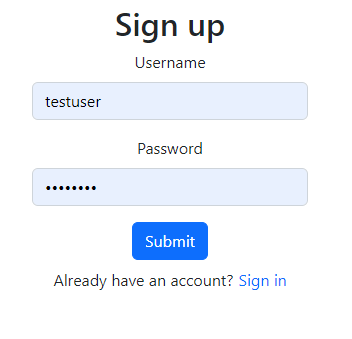

User story:
`As a user, I want to be able to sign in to the application so that I can interact with the application's content`

Implementation: 

Sign in form was created to provide an interface where a user can create an account. In addition, SIMPLE_JWT token was implemented in the backend, while access and refresh tokens are stored in local storage.

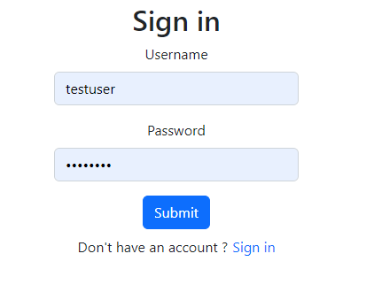

User story:
`As a user, I want to be able to view, edit or delete a task, so I can organize various actions if I change my mind`

Implementation: 

All tasks page was implemented to allow a user to view all tasks, where basic information is displayed in the form of a responsive table. For convenience, the action bar is also for user disposal, which reflects ownership status. 

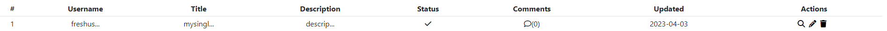

Moreover, users can access a detailed task view, where all information is unobstructed. An action bar is also present to allow to perform various actions on tasks.

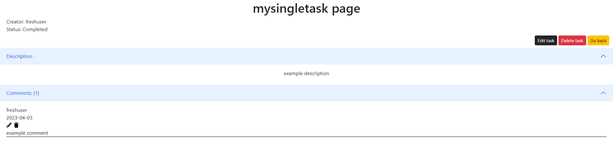

Edit task form allows users to edit a particular task
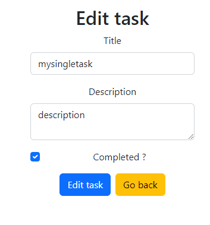

User story
`As a user I want to create a task so I can keep myself organized`

Implementation: 

A separate menu and add task form were implemented to ensure that authenticated users can add tasks.

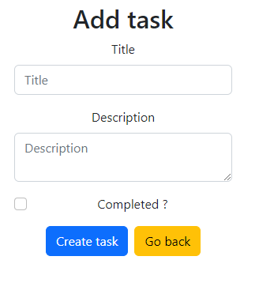

User story:
`As a user, I want to comment on each task, to interact with other users`

Implementation: 

Add comment form was implemented to ensure users can share information between themselves in the application. Add comment form can be accessed via a single detail task page

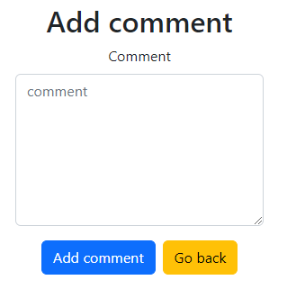

User story:
`As a user, I would like to view, edit or delete a comment, if I change my mind about it`

Implementation: 

Edit comment form was implemented. Furthermore, action bar is present to allow a user to edit or remove a comment from all comments if they are authorized to do so

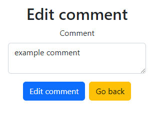

#### Planned features
- tasks filtering for easier access for a particular task 
- contact form to allow interaction between users and administration

[Back to Table of contents](#table-of-contents)
## Skeleton plane 
### Wireframes

<details>
<summary>All wireframes</summary>

* Home page

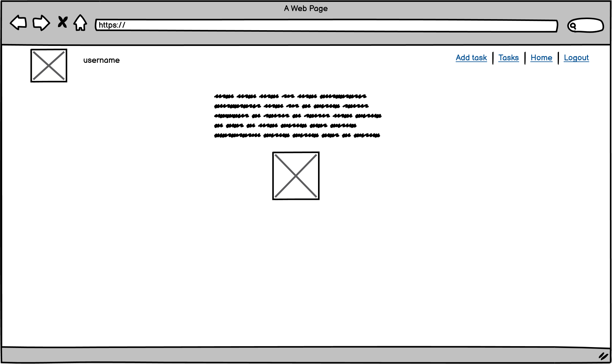
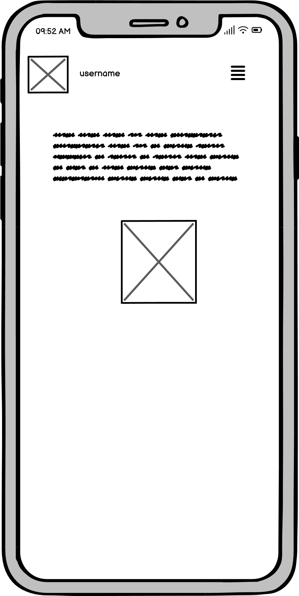

* Create task

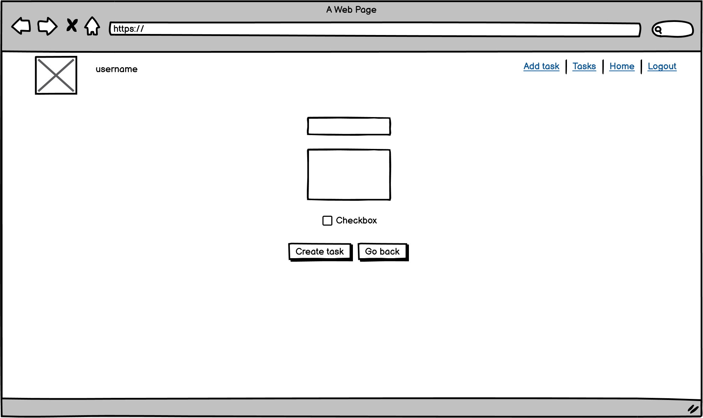
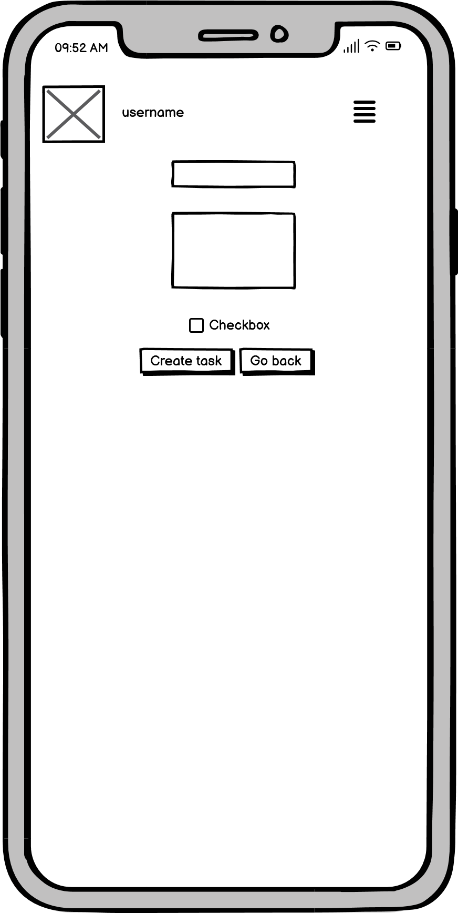

* Create comment

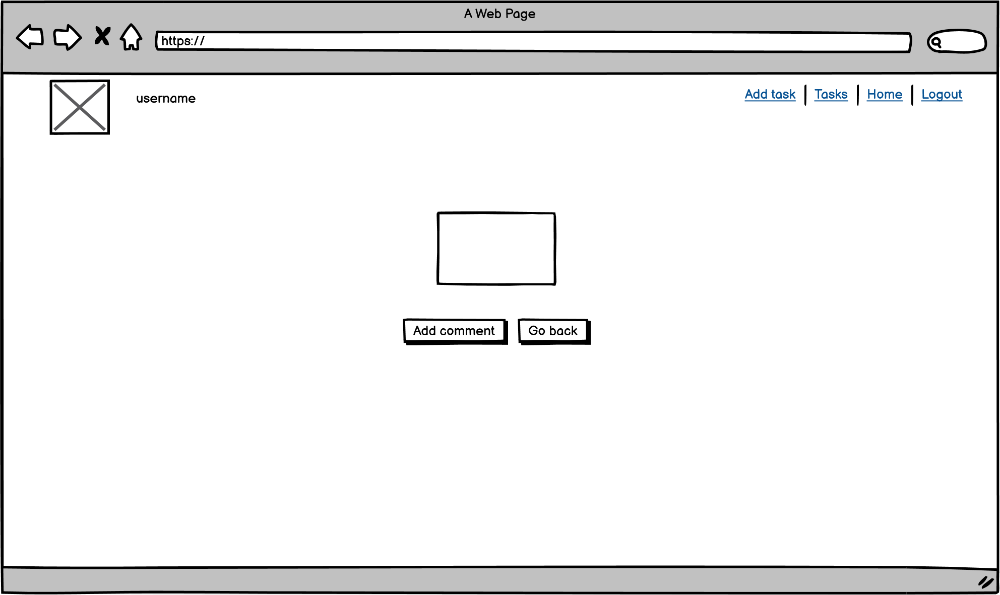
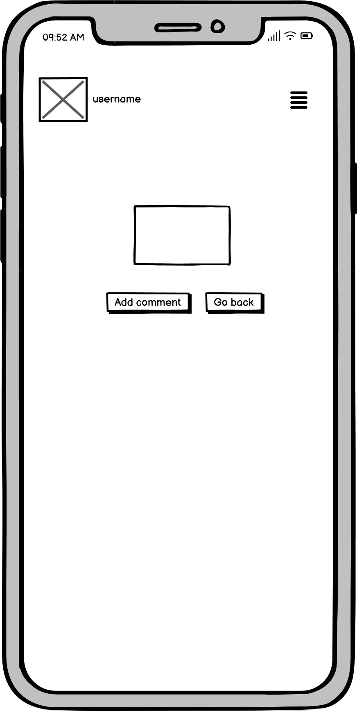

* Tasks page

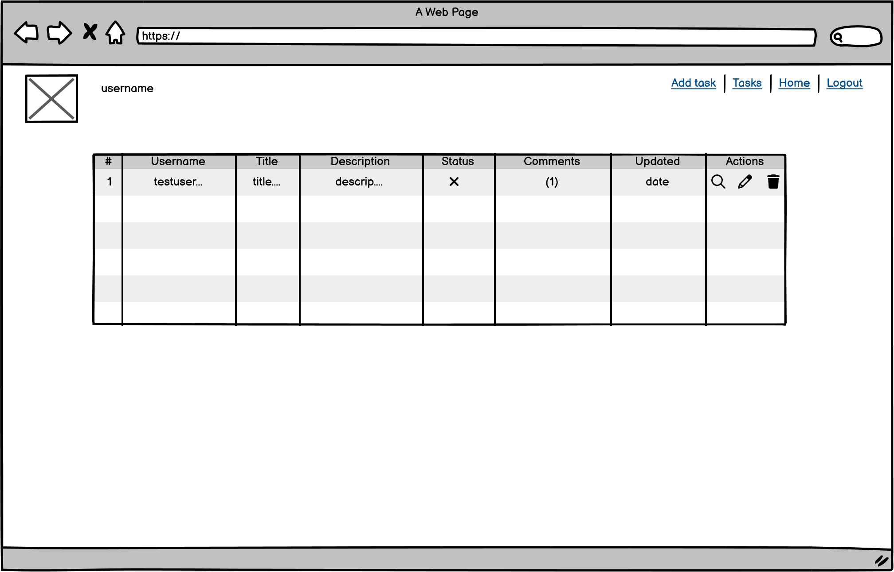
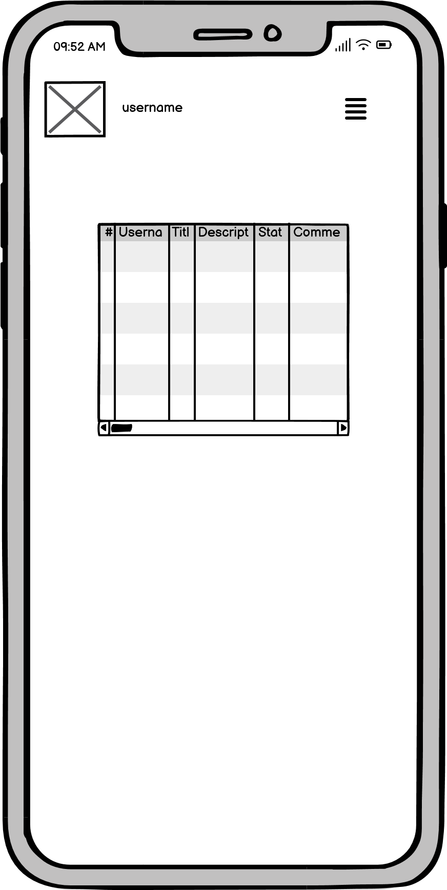

* Single task 

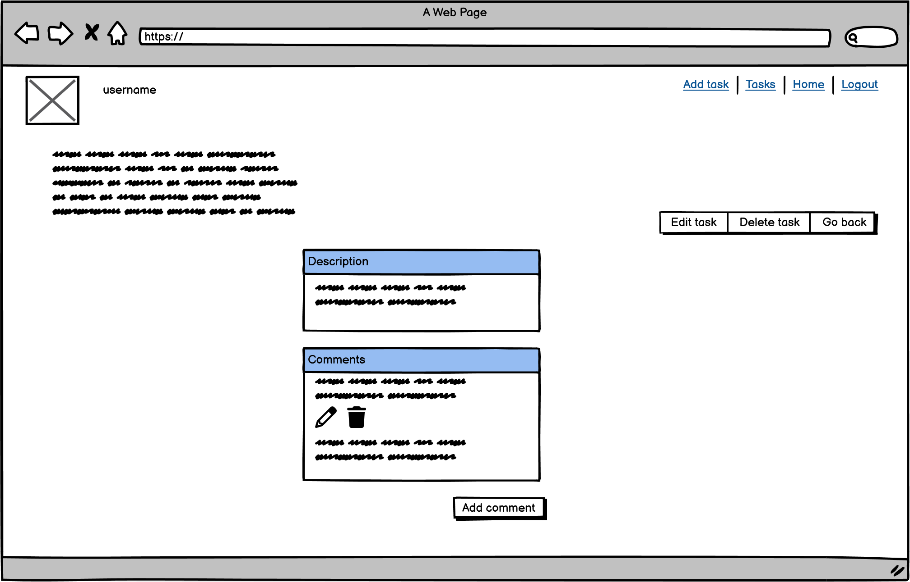
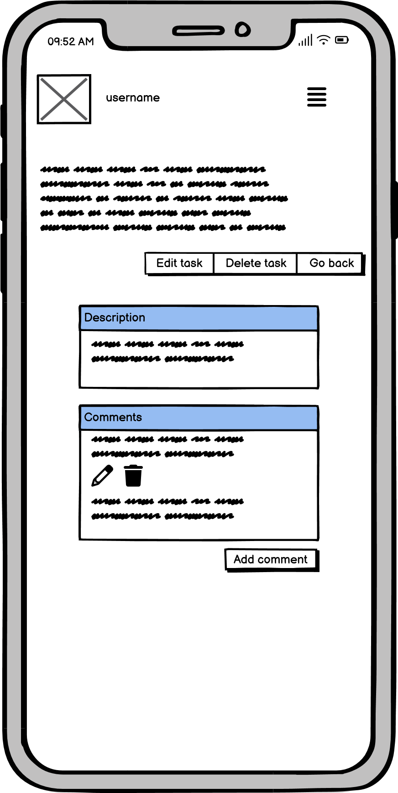

* Edit task

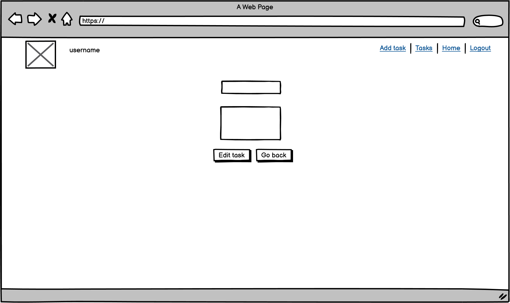
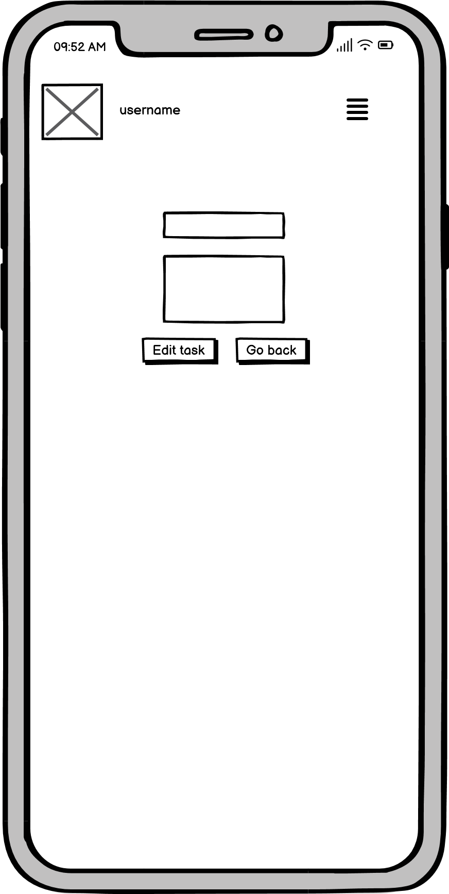


* Edit comment

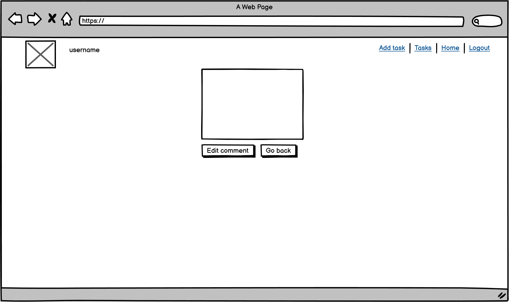
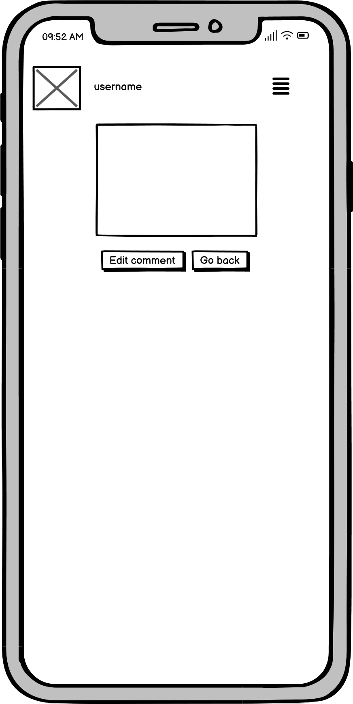

</details>

[Back to Table of contents](#table-of-contents)

## Surface plane

### Colour scheme
The main colour is white (#FFFFFF)
Navbar uses a dark theme from React Bootstrap framework.  Yellow (#f7f705) and orange colours were implemented to represent status and interactive elements.

[Back to Table of contents](#table-of-contents)
## Technologies

* React 
    * main frontend framework
* React Bootstrap
    * frontend framework used for components structure and styling
* Node
    * package manager
* Font Awesome 
    * icons
* Eslint
    * linting tool
* Heroku
    * application hosting
* Git
    * version control
* Github
    * code repository
* Balsamiq 
    * wireframes

[Back to Table of contents](#table-of-contents)
## Testing 

Test cases and results can be found in the [TESTING.md file](TESTING.md).
## Deployment
#### Version Control
The website was created in Virtual Studio Code editor, and changes were pushed to the GitHub repository https://github.com/bartoszgebarowski/lorecraft by using bash terminal. 

The following commands were used:

```git status``` - This command was used to check files staged and not staged for commit

```git add <file.extension>``` -  This command was used to add changes in file/files, with particular names and extensions, to be staged for commit

```git add .``` - This command was used to add changes in all files, regardless of name and extension, to be staged for commit

```git commit -m "commit message"``` - This command was used to commit all staged changes to a local repository

```git push``` - This command was used to upload all committed locally changes to a GitHub repository


#### Heroku Deployment

1. Navigate to Heroku website. Create an account or sign in to an existing account.
1. Click Create New App button
1. Choose a unique name for your application.
1. Open the "Settings" tab
1. Navigate to the Deploy tab and connect the Heroku to Github
1. Choose your Github repository and branch from which the application will be build
1. Choose a method of deployment(Automatic or Manual) and click Deploy branch button

#### Clone the Repository locally 

* Click the Code button
* Navigate to the HTTPS tab
* Click the clipboard copy icon (message "Copied" should appear instead of the icon)
* Choose the IDE with git bash support
* Use command ```git clone copied-url``` into bash terminal

[Back to Table of contents](#table-of-contents)
### Credits

Images
 * completed-concept-illustration by storyset (Freepik)
 * task-management-abstract-concept-illustration by vectorjuice (Freepik) 

[Axios setup](https://webera.blog/implement-refresh-token-with-jwt-in-react-app-using-axios-1910087c3d7)
#### Honourable mentions
* Daisy McGirr - mentor of the Code Institute, whose guidance was invaluable 
* Tobiasz Chodarewicz - a friend whose explanation of various code-related issues allowed me to tackle problems that I have encountered during the development process
* You - for visiting my Repository and reading the documentation

[Back to Table of contents](#table-of-contents)