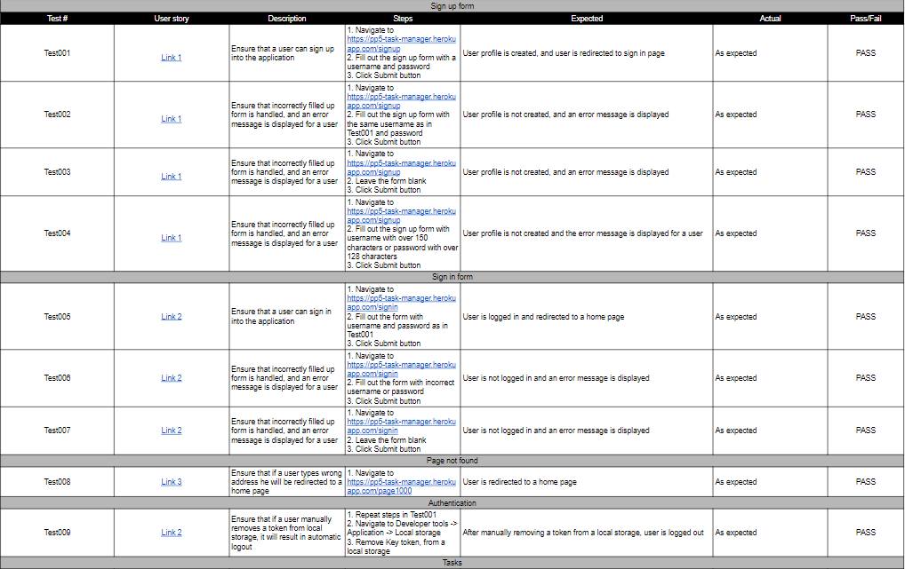
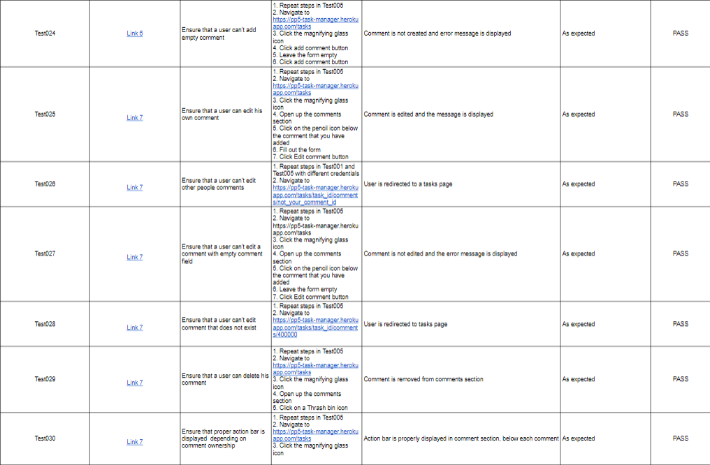

# User story testing

[Document can be viewed here](https://docs.google.com/spreadsheets/d/1SWAA9mB4-A2m58K9gB1c4AYcTs5VZn1PWrKaYkTBIqs/edit?usp=sharing)

## Lighthouse testing 

Lighthouse testing was performed, and found performance to be medium. This is a result of using Bootstrap React framework.

## Responsivness 

All pages were tested to support screen sizes from 320px and upwards.

Steps to test:

1. Open the browser and navigate to [Task manager page](https://pp5-task-manager.herokuapp.com/)
1. Open the developer tools
1. Set to dimensions to responsive
1. Set the zoom to 50%
1. Click the grey bar on the left to change the width

- Website was also opened on the following mobile devices:
Samsung Galaxy S7

## Eslint 

Eslint was installed and configured locally. In addition, [Online tool](https://eslint.org/play/) was used.

## Validators 

CSS modules included with this project passed through Jigsaw validator with no significant issues.

## Known bugs 
1. On page refresh, the user status is undefined and is set correctly after a delay.
Due to the nature of this problem, additional measurements had to be taken in order to ensure that user status was handled properly 